# PhysioCare

A physiotherapy app that lives in a single HTML file. Download it, open it in your browser, done. No npm install, no server, nothing to set up.

I built this as a home recovery companion — the kind of thing you send to someone and they can actually use it straight away without any technical knowledge.

---

## Screenshots

| Splash | Login | Register |
|--------|-------|----------|
| 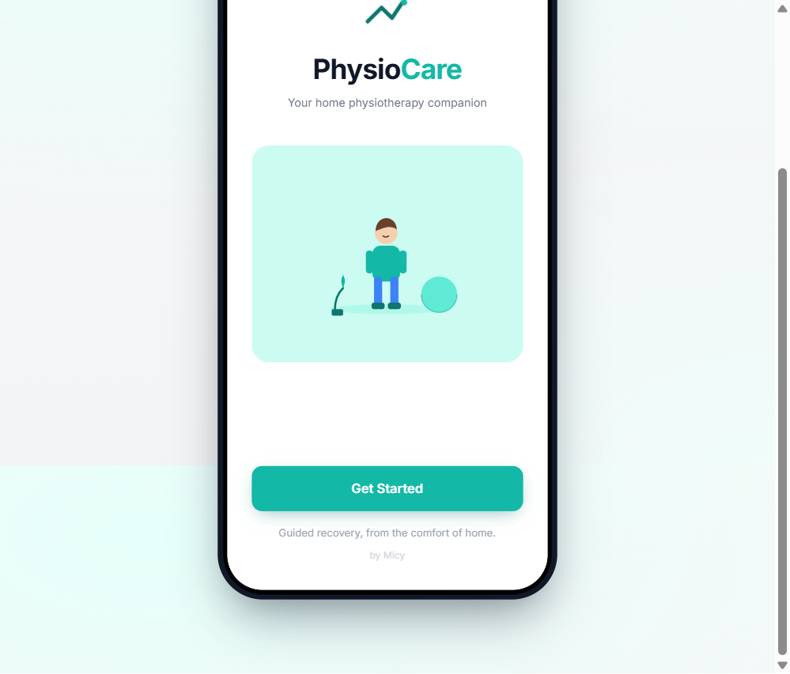 | 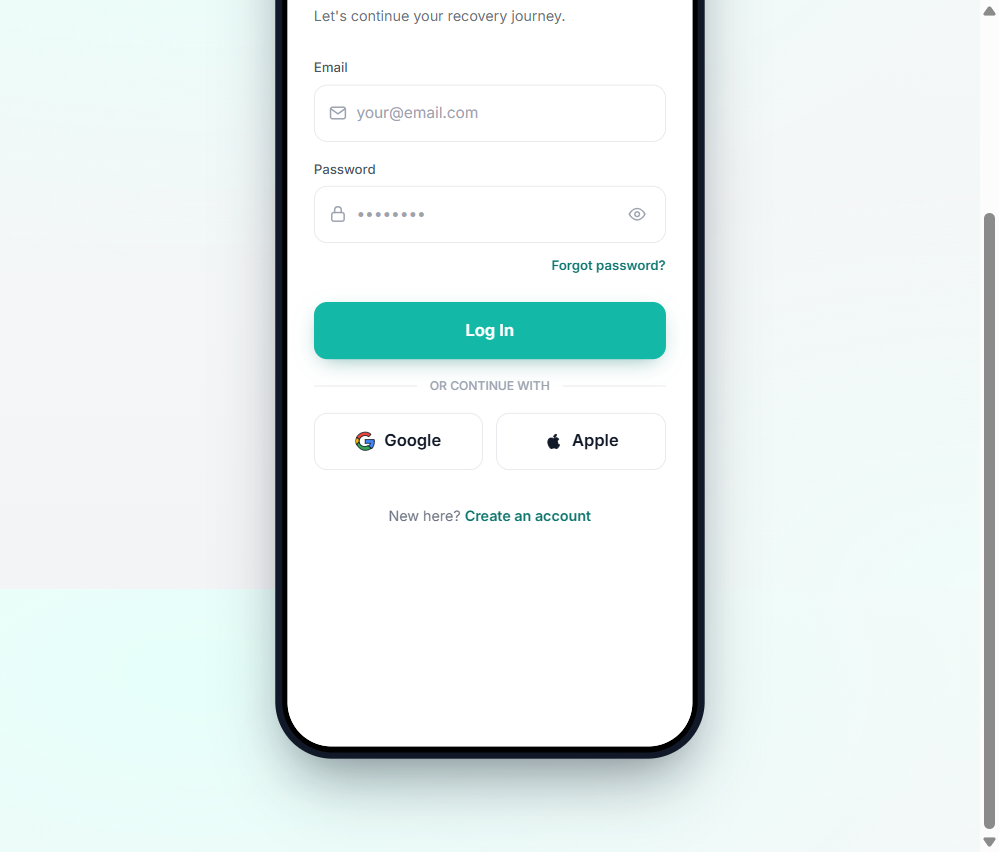 | 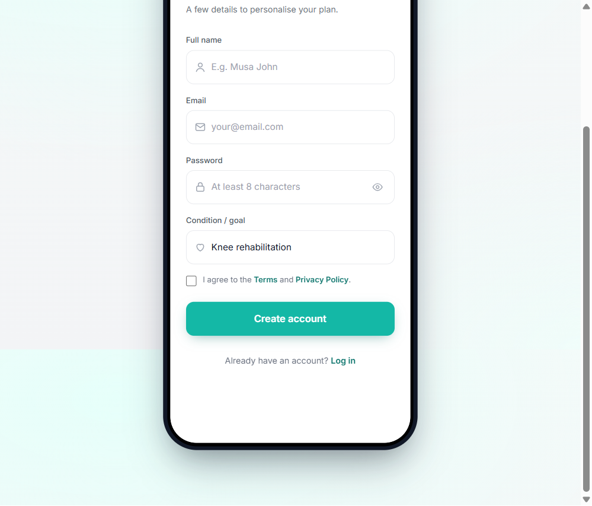 |

| Dashboard | Dashboard |
|-----------|-----------|
| 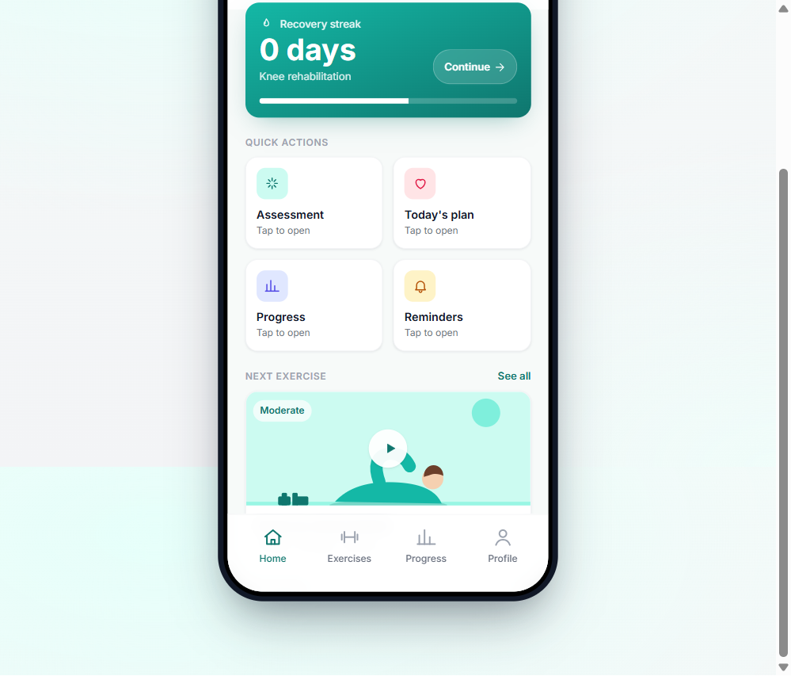 | 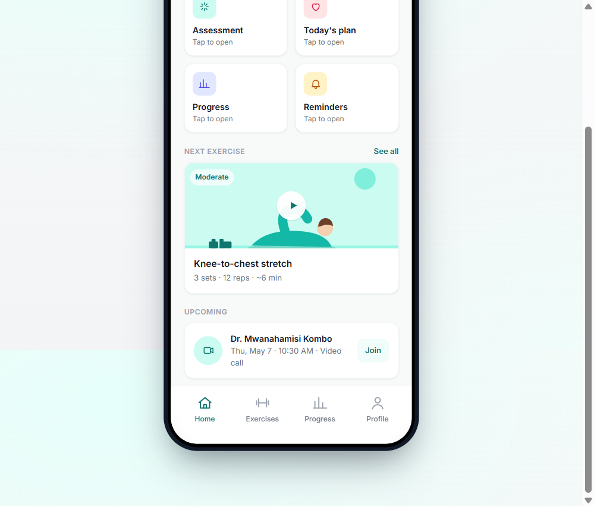 |

| Exercises | Exercises |
|-----------|-----------|
| 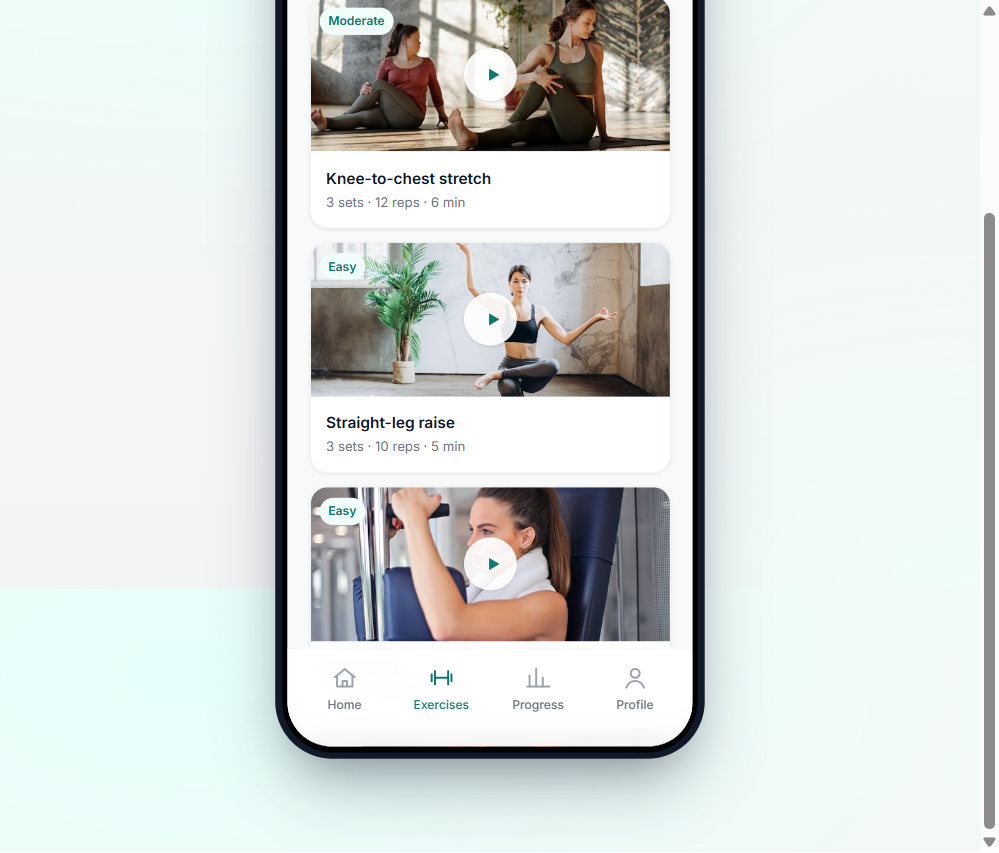 | 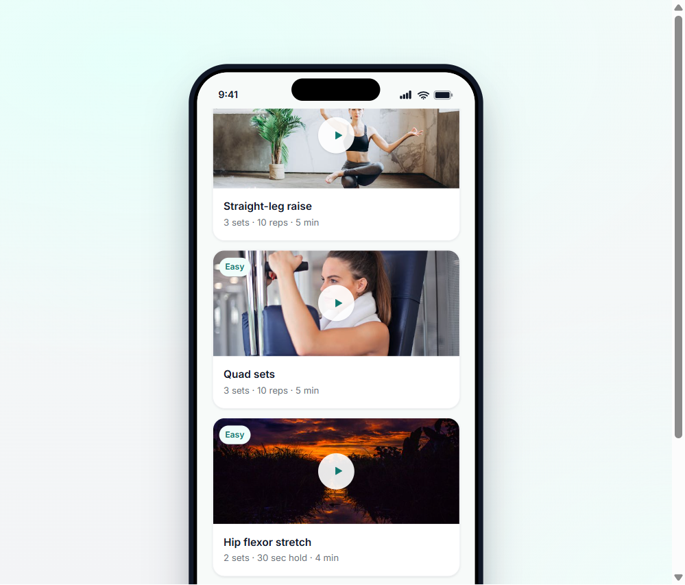 |

| Exercise Detail | Exercise Detail |
|-----------------|-----------------|
| 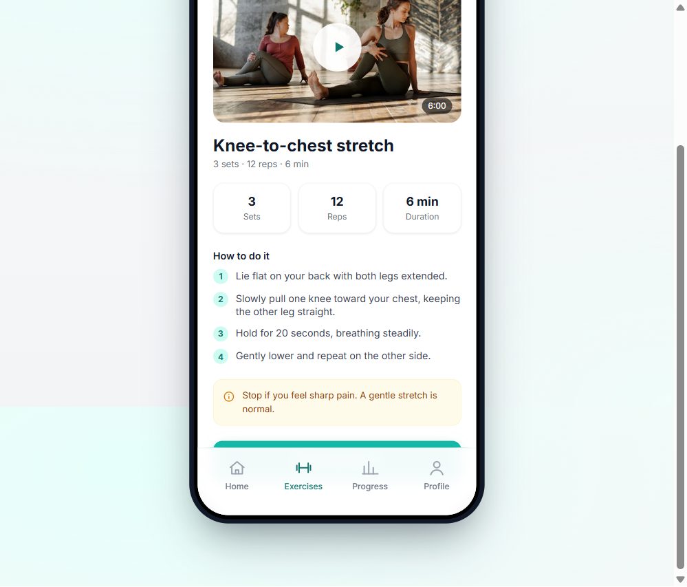 | 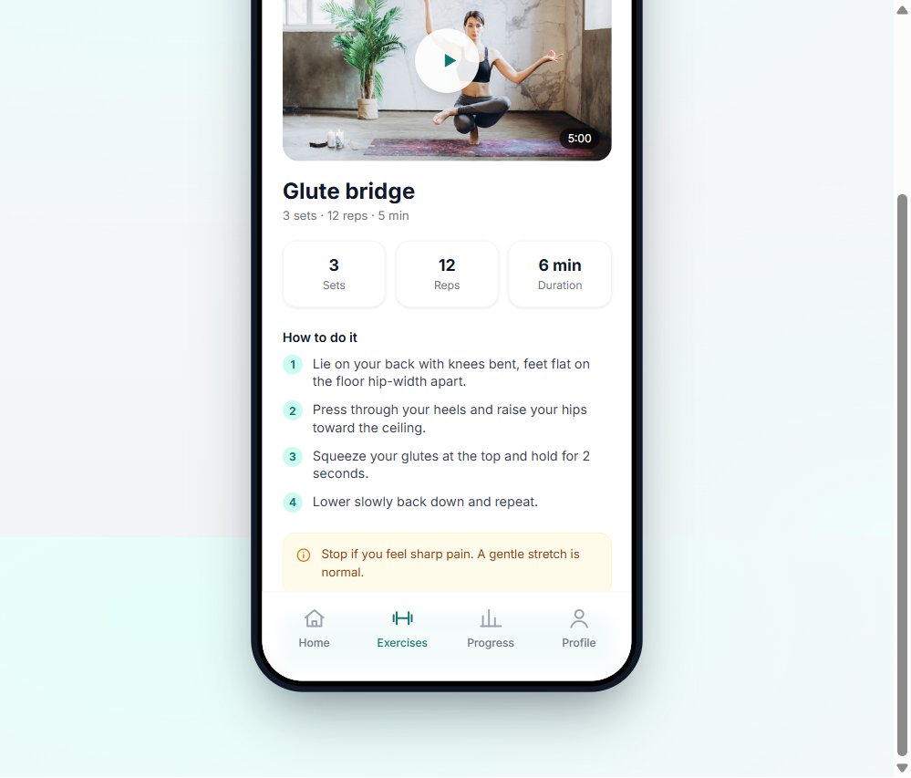 |

| Progress | Reminders | Profile |
|----------|-----------|---------|
| 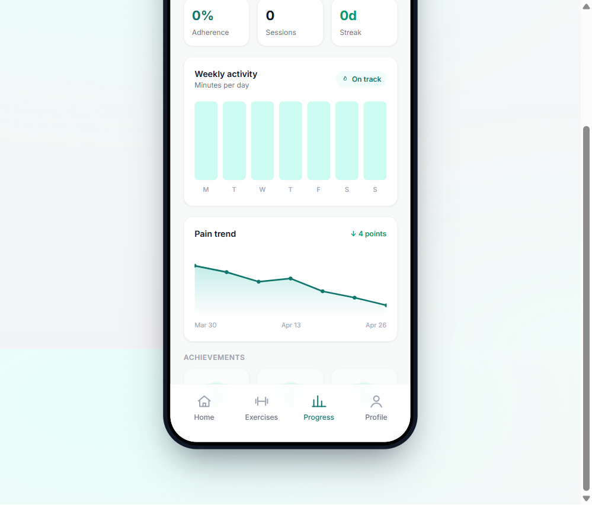 | 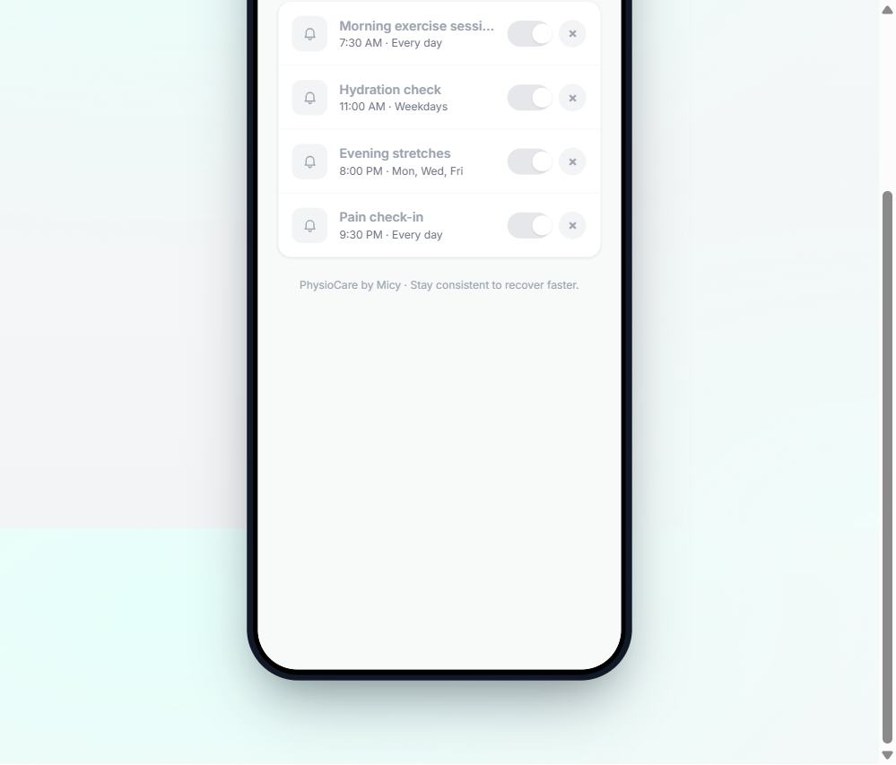 | 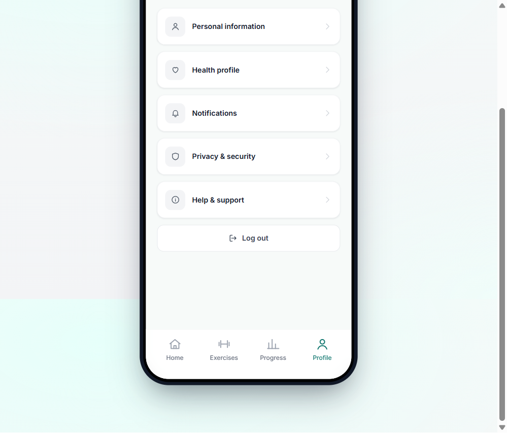 |

---

## What it does

- 15 exercises with videos, step-by-step instructions, and Easy/Moderate difficulty tags
- Tracks your streak, sessions completed, and weekly activity — all stored locally per user
- Reminders with real browser notifications (you set the time, it fires when you're away from the app)
- Each user has their own account and progress — multiple people can use the same device
- Pick your condition when signing up (knee rehab, back pain, etc.) and the dashboard adjusts
- Works completely offline once the page has loaded

---

## Running it

1. Download `PhysioCare App standalone.html`
2. Open it in Chrome, Edge, Firefox, or Safari
3. That's it

---

## Sharing it

The easiest way is to just send the file over WhatsApp or email as an attachment — the other person opens it and it works.

If you want a link instead of a file, drag it to [netlify.com/drop](https://netlify.com/drop) and you'll get a public URL in about 10 seconds. Or enable GitHub Pages on this repo (Settings → Pages → main branch) for a permanent link.

---

## Under the hood

Everything runs in the browser — React 18 via unpkg, Tailwind CSS from CDN, Babel for JSX. Data is saved to `localStorage` so nothing ever leaves the device. Videos are served from Pixabay.

---

Made by Micy
